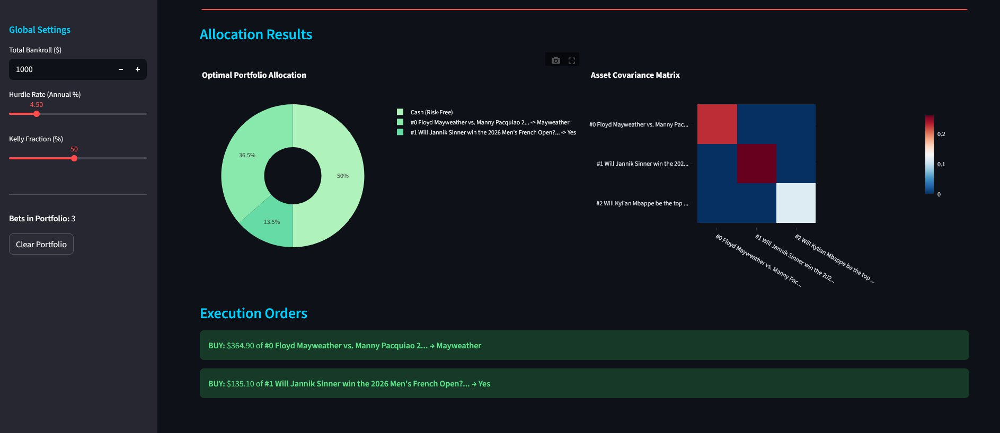
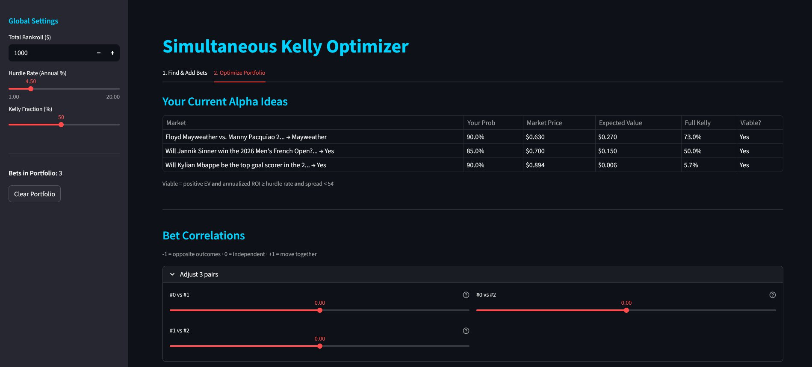

## TL;DR

You can try the live web app here: https://kelly-portfolio.streamlit.app/

I wanted to find a mathematically sound way to manage a portfolio of prediction market bets. This web app allows you to search for Polymarket events, calculate their Expected Value (EV), and run a Simultaneous Kelly Criterion optimization to size your bets while accounting for structural correlations between them.

## 1. Market Data Retrieval (`api_client.py`)

This module connects to the Polymarket API to fetch live events and their order books, bypassing stringified JSON bugs in their Gamma API and extracting true Bid-Ask spreads.

### Functions:

* **`get_all_options_from_url(polymarket_url)`**
    Scans a given Polymarket event URL by extracting its slug, querying the Gamma API, and parsing all the tradable options available within that market.

* **`get_order_book(token_id)`**
    Fetches the live order book from the CLOB API for a specific token. It parses the bids and asks to find the absolute minimum ask and maximum bid, calculating the true spread to determine if the market is tradable (liquid enough).

```console
[*] Scanning URL: https://polymarket.com/sports/nba/nba-mia-cha-2026-03-17

[+] Found 2 tradable options:

  [0] Miami Heat vs Charlotte Hornets -> Bet on: 'Miami Heat'
  [1] Miami Heat vs Charlotte Hornets -> Bet on: 'Charlotte Hornets'

--------------------------------------------------
[*] Simulating user selecting option [0]...

Market: Miami Heat vs Charlotte Hornets
Outcome: Miami Heat
Best Ask (Buy Price):  $0.55
Best Bid (Sell Price): $0.53
Spread:                $0.02
```



## 2. Portfolio Math & Logic (`math_logic.py`)

This is the core mathematical engine. It calculates individual bet metrics and runs the complex portfolio optimization based on Mean-Variance Kelly.

### Functions:

* **`evaluate_bet(true_probability, market_data, hurdle_rate)`**
    Calculates the Expected Value (EV) and the Full Kelly stake for a single bet. It also parses the event's end date to calculate the annualized ROI, flagging the bet as viable only if the EV is positive, the ROI clears the hurdle rate, and the spread is tight.

* **`get_structural_correlation(bet_a, bet_b)`**
    Computes a smart default correlation for pairs of bets. If they belong to the same market (mutually exclusive outcomes), it derives a negative correlation based on their joint Bernoulli structure. If they are different events, it defaults to 0.0 (independent).

* **`optimize_portfolio(portfolio_bets, kelly_fraction, correlations)`**
    Runs a Simultaneous Kelly Optimization using SciPy's `minimize` function. It builds a covariance matrix from user-provided correlations and the standard deviations of the Bernoulli returns. The optimizer maximizes the log-growth of the portfolio, ensuring that the total allocated capital doesn't exceed 100%, and finally scales the results by the user's chosen Kelly fraction.

## 3. Web Application (`app.py`)

The frontend of the project, built with Streamlit. It acts as a "shopping cart" for alpha ideas and a dashboard for risk management.

### Features:

* **Find & Add Bets:** Users can paste a Polymarket URL, select an outcome, input their "True Probability", and add the bet to their portfolio if it passes the viability checks.
* **Portfolio Optimization:** A dashboard where users can view all their alpha ideas and adjust the correlation sliders between any pair of bets. Running the optimization generates a pie chart of the optimal allocation (including cash reserves) and a heatmap of the Asset Covariance Matrix using Plotly. It outputs exact dollar amounts to execute for each bet.



## Conclusions

It was a very interesting project to learn about the Simultaneous Kelly Criterion and how to manage the covariance of binary outcomes in prediction markets. Treating bets not as isolated wagers but as a holistic portfolio is crucial for long-term growth.

Some other things to try are implementing automated execution via Polymarket's API so the calculated orders are placed directly from the app, expanding the `get_structural_correlation` function to automatically scrape and infer correlations across different markets, or adding support for other prediction markets like Kalshi.

## Run it locally

If you want to test the code on your own machine, clone this repository and install the dependencies:

```bash
git clone https://github.com/yourusername/kelly-prediction-markets.git
cd kelly-prediction-markets
pip install -r requirements.txt
streamlit run app.py
```
